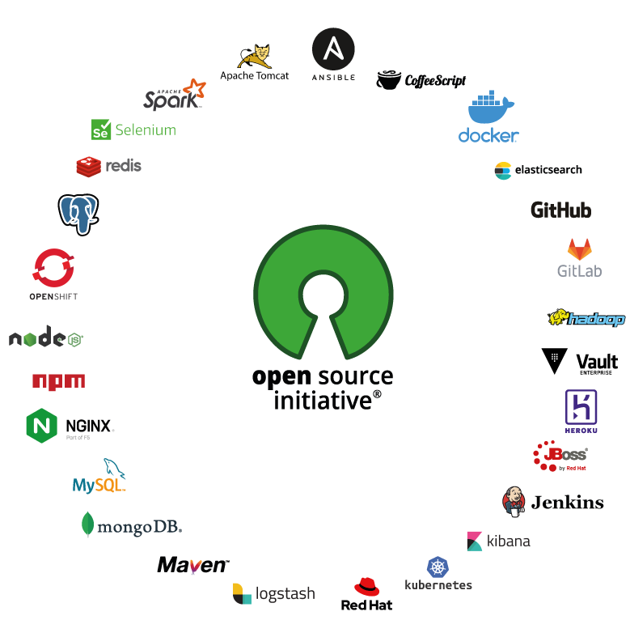

# Implementation

    Course Code: COMP1856 
    
    Course Name: Software Engineering

    Credits: 15

    Module Leader: Seb Blair BEng(H) PGCAP MIET MIHEEM FHEA

---

## Implementation issues

- Focus here is not on programming, although this is obviously important, but on other implementation issues that are often not covered in programming texts:
  - **Reuse** Most modern software is constructed by reusing existing components or systems. When you are developing software, you should make as much use as possible of existing code.
  - **Configuration management** During the development process, you have to keep track of the many different versions of each software component in a configuration management system.
  - **Host-target development** Production software does not usually execute on the same computer as the software development environment. Rather, you develop it on one computer (the host system) and execute it on a separate computer (the target system).


---

## Reuse

- From the 1960s to the 1990s, most new software was developed from scratch, by writing all code in a high-level programming language. 
   - The only significant reuse of software was the reuse of functions and objects in programming language libraries. 

- Costs and schedule pressure mean that this approach became increasingly unviable, especially for commercial and Internet-based systems. 

- An approach to development based around the reuse of existing software emerged and is now generally used for business and scientific software. 

---
## Reuse levels

- **The abstraction level**
  - At this level, you don’t reuse software directly but use knowledge of successful abstractions in the design of your software. 

- **The object level**
  - At this level, you directly reuse objects from a library rather than writing the code yourself. 

- **The component level**
  - Components are collections of objects and object classes that you reuse in application systems. 

- **The system level**
  - At this level, you reuse entire application systems. 

---

## Software Reuse



---

## Reuse costs

- The costs of the time spent in looking for software to reuse and assessing whether or not it meets your needs. 

- Where applicable, the costs of buying the reusable software. For large off-the-shelf systems, these costs can be very high.

- The costs of adapting and configuring the reusable software components or systems to reflect the requirements of the system that you are developing.

- The costs of integrating reusable software elements with each other (if you are using software from different sources) and with the new code that you have developed. 

---

## Configuration management

- Configuration management is the name given to the general process of managing a changing software system. 

- The aim of configuration management is to support the system integration process so that all developers can access the project code and documents in a controlled way, find out what changes have been made, and compile and link components to create a system.

---

## Configuration management activities

- **Version management**, where support is provided to keep track of the different versions of software components. Version management systems include facilities to coordinate development by several programmers. 

- **System integration**, where support is provided to help developers define what versions of components are used to create each version of a system. This description is then used to build a system automatically by compiling and linking the required components.

- **Problem tracking**, where support is provided to allow users to report bugs and other problems, and to allow all developers to see who is working on these problems and when they are fixed. 

---

## What does Open Source Mean?



---

## Open source development

- **Open source development** is an approach to software development in which the source code of a software system is published and volunteers are invited to participate in the development process

- Its roots are in the **Free Software Foundation** ([www.fsf.org](www.fsf.org)), which advocates that source code should not be proprietary but rather should always be available for users to examine and modify as they wish. 

- Open source software extended this idea by using the Internet to recruit a much larger population of volunteer developers. Many of them are also users of the code.

---

## Open source systems

- The best-known open source product is, of course, the Linux operating system which is widely used as a server system and, increasingly, as a desktop environment.

- Other important open source products are Java, the Apache web server and the mySQL database management system. 


--- 

## Open source issues

- Should the product that is being developed make use of open source components?

- Should an open source approach be used for the software’s development?

**Questions:**
- If you are a software developer would you offer your programs as open source? Why or why not?
- If the software is open source where will your profits come from?
- What are the benefits of open source software development for the developers themselves?

--- 

## Open source business

- More and more product companies are using an open source approach to development. 

- Their business model is not reliant on selling a software product but on selling support for that product. 

- They believe that involving the open source community will allow software to be developed more cheaply, more quickly and will create a community of users for the software. 

---

## Open source licensing

- A fundamental principle of open-source development is that source code should be freely available, this does not mean that anyone can do as they wish with that code.
  
  - Legally, the developer of the code (either a company or an individual) still owns the code. They can place restrictions on how it is used by including legally binding conditions in an open source software license. 
  
  - Some open source developers believe that if an open source component is used to develop a new system, then that system should also be open source. 
  
  - Others are willing to allow their code to be used without this restriction. The developed systems may be proprietary and sold as closed source systems (e.g. distributed under a licensing agreement).

----

## License models

- The GNU General Public License (GPL). This is a so-called ‘reciprocal’ license that means that if you use open source software that is licensed under the GPL license, then you must make that software open source. 

- The GNU Lesser General Public License (LGPL) is a variant of the GPL license where you can write components that link to open source code without having to publish the source of these components. 

- The Berkley Standard Distribution (BSD) License. This is a non-reciprocal license, which means you are not obliged to re-publish any changes or modifications made to open source code. You can include the code in proprietary systems that are sold.

---

## [Hubot Licence (MIT)](https://github.com/hubotio/hubot/blob/main/LICENSE.md)


<div style="font-size:20px">

```md
Copyright (c) 2011-2023 GitHub Inc.

Permission is hereby granted, free of charge, to any person obtaining
a copy of this software and associated documentation files (the
"Software"), to deal in the Software without restriction, including
without limitation the rights to use, copy, modify, merge, publish,
distribute, sublicense, and/or sell copies of the Software, and to
permit persons to whom the Software is furnished to do so, subject to
the following conditions:

The above copyright notice and this permission notice shall be
included in all copies or substantial portions of the Software.

THE SOFTWARE IS PROVIDED "AS IS", WITHOUT WARRANTY OF ANY KIND,
EXPRESS OR IMPLIED, INCLUDING BUT NOT LIMITED TO THE WARRANTIES OF
MERCHANTABILITY, FITNESS FOR A PARTICULAR PURPOSE AND
NONINFRINGEMENT. IN NO EVENT SHALL THE AUTHORS OR COPYRIGHT HOLDERS BE
LIABLE FOR ANY CLAIM, DAMAGES OR OTHER LIABILITY, WHETHER IN AN ACTION
OF CONTRACT, TORT OR OTHERWISE, ARISING FROM, OUT OF OR IN CONNECTION
WITH THE SOFTWARE OR THE USE OR OTHER DEALINGS IN THE SOFTWARE.
```

</div>

---

## Licensing a Repository

- [Github.com - Licensing](https://docs.github.com/en/repositories/managing-your-repositorys-settings-and-features/customizing-your-repository/licensing-a-repository)

- [Creative Commons](https://chooser-beta.creativecommons.org/)