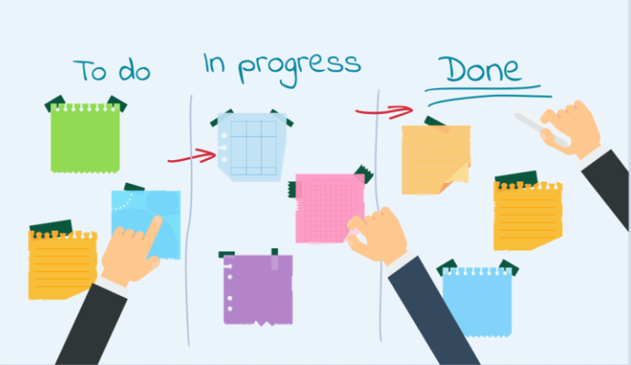
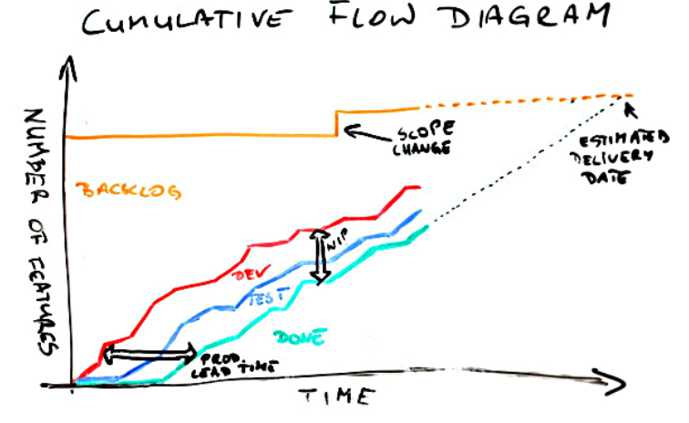

# Kanban

    Course Code: COMP1856 
    
    Course Name: Software Engineering

    Credits: 15

    Module Leader: Seb Blair BEng(H) PGCAP MIET MIHEEM FHEA

---

## Introduction

- Developed by Taiichi Ohno(Industrial Engineer and Businessman) for Toyota automotive. 
- early 1940's 
- Simple planning system, the aim of which was to control and manage work and inventory at every stage of production optimally.
- David J. Anderson who was the first to apply the concept to IT, Software development and knowledge work in general in the year 2004

---

## Four Foundational Principles

1. Start with what you are doing now
2. Agree to pursue incremental, evolutionary change
3. Initially, respect current roles, responsibilities and job-titles
4. Encourage acts of leadership at all levels

<!--
Start with what you are doing now: The Kanban Method (hereafter referred to as just Kanban) strongly emphasizes not making any change to your existing setup/ process right away. Kanban must be applied directly to current workflow. 

Any changes needed can occur gradually over a period of time at a pace the team is comfortable with.

Agree to pursue incremental, evolutionary change: Kanban encourages you to make small incremental changes rather than making radical changes that might lead to resistance within the team and organization.

Initially, respect current roles, responsibilities and job-titles: Unlike other methods, Kanban does not impose any organizational changes by itself. So, it is not necessary to make changes to your existing roles and functions which may be performing well. The team will collaboratively identify and implement any changes needed. These three principles help the organizations overcome the typical emotional resistance and the fear of change that usually accompany any change initiatives in an organization.

Encourage acts of leadership at all levels: Kanban encourages continuous improvement at all the levels of the organization and it says that leadership acts don’t have to originate from senior managers only. People at all levels can provide ideas and show leadership to implement changes to continually improve the way they deliver their products and services.
-->
---

## Six Practices of the Kanban Method

1. Visualize the flow of work
2. Limit WIP (Work in Progress)
3. Manage Flow
4. Make Process Policies Explicit
5. Implement Feedback Loops
6. Improve Collaboratively, Evolve Experimentally

<!--
2. Typically, many teams start with a WIP Limit of 1 to 1.5 times the number of people working in a specific stage. Limiting WIP and putting the WIP limits on each column of the board not only helps the team members first finish what they are doing before taking up new stuff – but also communicates to the customer and other stakeholders that there is limited capacity to do work for any team – and they need to plan carefully what work they ask the team to do.

-->

---

## Classic Kanban

In a classic Kanban board model, there are three columns, as shown in the picture above:

- “To Do”: This column lists the tasks that are not yet started. (aka “backlog”)

- “Doing”: Consists of the tasks that are in progress.
  
- “Done”: Consists of the tasks that are completed

---
## Kanban Diagram

<!--

Kanban Cards – This is the visual representation of tasks. Each card contains information about the task and its status, such as deadline, assignee, description, etc.

Kanban Columns – Each column on the board represents a different stage of your workflow. The cards go through the workflow until their full completion.

Work-in-Progress Limits – They restrict the maximum amount of tasks in the different stages of the workflow. Limiting WIP allows you to finish work items faster by helping your team focus only on current tasks.

Kanban Swimlanes – These are horizontal lanes you can use to separate different activities, teams, classes of service, and more.

Commitment Point – A commitment marks a point in the work process where a work item is ready to be pulled into the system.

Delivery Point – The point in the workflow where work items are considered finished.

-->
---

## Work-in-Progress (WIP) Limits

1. Rather than timeboxing, like we do with sprints in Scrum, Kanban is a continuous flow of work,  limited by the constraint on that column of the Kanban board.

2. You set your column limits to avoid bottlenecks in your development process. If there is a build up or slow movement in one stage, you can adjust the WIP limits in the columns either side to prevent a build up of stress on a single point in the system.

---

## Why do we limit WIP?

---

## How to decide WIP limits?

- Measure flow
- Where are your bottlenecks?
- How do you manage them?
- Do you throw more engineering resource at one of the stages? If you do, then what impact will that have on the following stage?
- Redeployment of resource to earlier stages or later stages may be a better way to ensure a constant flow.

---

## Kanban Flow

The concept of Flow is critical and by measuring Flow metrics and working to improve them, you can dramatically improve the speed of your delivery processes while reducing cycle time and improving the quality of your products or services by getting faster feedback from your customers – internal or external.

<!--

At the core of Kanban is the concept of “Flow”. This means that the cards should flow through the system as evenly as possible, without long waiting times or blockages. Everything that hinders the flow should be critically examined. Kanban has different techniques, metrics and models, and if these are consistently applied, it can lead to a culture of continuous improvement (kaizen)

-->
---

## Cumulative Flow Diagrams

- In Kanban we use cumulative flow diagrams to show how much work we are completing

---

## Releasing in Kanban

- Using Kanban, **continuous deployment** is possible. 

- You can release a new iteration of your product every day.

- This has a huge advantage, even over **Scrum**, which pridws itself on releasing early and often

- Where feedback in **Scrum** can only be gathered at the end of the sprint, meaning any feature built in day one has a feedback lag of *~2 weeks*, new features can Kanban can be tested by users as soon as they are completed.

---

## Kanban for you

- Kanban is a great approach for small projects, it helps you focus on actually finishing features.
- As an agile methodology, the idea of Kanban is to increase the likelihood that your project is going to be successful.
- Especially when working on your own, you may be tempted to work on features in an arbitrary fashion eg. half building a form, then realizing you need a database, so half building a database, then building part of the logic, while finishing nothing.
- Using Kanban, visualizing your work and limiting WIP can help prevent this.

---

## Kanban in your career

- Aside from fast moving startups or small projects you probably won’t be developing using Kanban.
- However, a working knowledge of Kanban is in demand 

---

## Kanban as a Tool

- Rather than look for companies that solely use Kanban, it is important to know that Kanban is a tool that you can utilize.

- When presented with a project, consider whether Scrum, Kanban or waterfall would fit the project best.

- A lot of R&D departments will use Kanban due to the lightweight nature of the methodology and the speed at which you can deliver features.

---

## Kanban in Enterprise

- I’ve not seen a good example of Kanban scaling up very well

- Some teams use a modified version of Kanban

- This embraces the Agile mindset of ‘use what works’

- Hybrid approaches such as ScrumBan are relatively popular

- Some corporate management teams do not like Software Development teams using Kanban, as it can be hard to track progress and make estimates.

- This is where Scrum helps.

---

## Summary

- Another agile methodology 

- A very different use to Scrum

- Spotify is known for utilizing Kanban amongst other agile methodologies 

- Very good for extremely small teams or even individuals.

